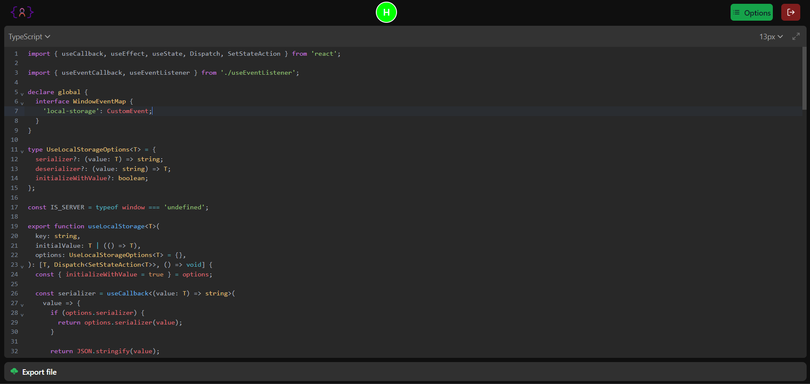

<div align="center">
  
</div>
<h1 align="center">
  LetsCode Collaborative Editor
</h1>



#### A simple collaborative code editor that allows people to work together in real-time. There is a lot more features to implement, like allowing people to work on several files or even a folder, maybe a maybe even a chat box for the collaborators to talk in real-time. Most of the UI are from NextUI library.

## 🛠 Installation & Set Up

1. Download the repo :up:

   > [click here](https://github.com/AbassHammed/RealtimeEditor)

2. Install and use the correct version of Node using [NVM](https://github.com/nvm-sh/nvm)

   ```sh
   nvm install
   ```

3. Install dependencies from the directory path

   ```sh
   npm install
   ```

4. Create your `.env.local` file

   > Add your backend Endpoint URL in it

5. Start the development server

   ```sh
   npm run dev
   ```

## 🚀 Building and Running for Production

1. Generate a full static production build

   ```sh
   npm run build
   ```

1. Preview the site as it will appear once deployed

   ```sh
   npm run start
   ```
